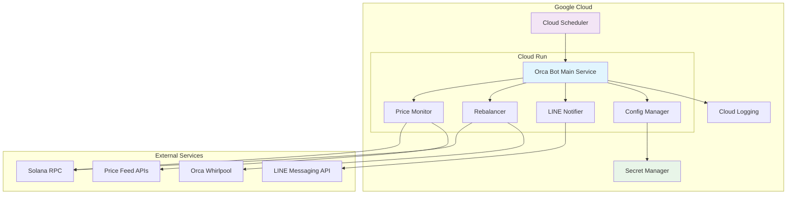

# Design Document: Orca Liquidity Bot

## Overview

Orca Liquidity Botは、SolanaブロックチェーンのOrcaプロトコル上でSOL-USDC流動性供給ポジションを自動管理するRustベースのシステムです。価格監視、自動リバランス、Yield回収、LINE通知機能を提供し、Google Cloud上で継続的に動作します。

システムは以下の主要コンポーネントで構成されます：
- **Price Monitor**: 価格監視とレンジ逸脱検知
- **Rebalancer**: ポジション再調整とYield回収
- **LINE Notifier**: 通知システム
- **Scheduler**: 定期実行管理
- **Configuration Manager**: 設定管理

## Architecture



## Components and Interfaces

### 1. Main Service (Orca Bot)

**責任**: システム全体の調整とワークフロー管理

```rust
pub struct OrcaBot {
    price_monitor: PriceMonitor,
    rebalancer: Rebalancer,
    notifier: LineNotifier,
    config: Config,
}

impl OrcaBot {
    pub async fn run_hourly_check(&self) -> Result<(), BotError>;
    pub async fn run_daily_collection(&self) -> Result<(), BotError>;
    pub async fn handle_emergency(&self, error: &BotError) -> Result<(), BotError>;
}
```

### 2. Price Monitor

**責任**: 価格監視とレンジ逸脱の検知

```rust
pub struct PriceMonitor {
    rpc_client: RpcClient,
    price_history: PriceHistory,
}

pub struct PriceData {
    pub current_price: f64,
    pub timestamp: DateTime<Utc>,
    pub source: PriceSource,
}

impl PriceMonitor {
    pub async fn get_current_price(&self) -> Result<PriceData, PriceError>;
    pub async fn check_range_deviation(&self, position: &Position) -> Result<bool, PriceError>;
    pub async fn store_price_history(&mut self, price: PriceData) -> Result<(), PriceError>;
}
```

### 3. Rebalancer

**責任**: ポジション管理、Yield回収、リバランス実行

```rust
pub struct Rebalancer {
    whirlpool_client: WhirlpoolClient,
    wallet: Keypair,
}

pub struct PositionMetrics {
    pub total_balance_usd: f64,
    pub sol_amount: f64,
    pub usdc_amount: f64,
    pub collected_yield: f64,
    pub sol_price: f64,
}

impl Rebalancer {
    pub async fn collect_yield(&self, position: &Position) -> Result<f64, RebalanceError>;
    pub async fn close_position(&self, position: &Position) -> Result<(), RebalanceError>;
    pub async fn create_new_position(&self, range: PriceRange) -> Result<Position, RebalanceError>;
    pub async fn calculate_optimal_range(&self) -> Result<PriceRange, RebalanceError>;
    pub async fn get_position_metrics(&self) -> Result<PositionMetrics, RebalanceError>;
}
```

### 4. LINE Notifier

**責任**: LINE Bot経由での通知送信

```rust
pub struct LineNotifier {
    client: LineClient,
    channel_access_token: String,
    user_id: String,
}

pub struct NotificationData {
    pub event_type: EventType,
    pub metrics: PositionMetrics,
    pub timestamp: DateTime<Utc>,
}

impl LineNotifier {
    pub async fn send_rebalance_notification(&self, data: &NotificationData) -> Result<(), NotificationError>;
    pub async fn send_daily_report(&self, data: &NotificationData) -> Result<(), NotificationError>;
    pub async fn send_emergency_alert(&self, error: &BotError) -> Result<(), NotificationError>;
}
```

### 5. Configuration Manager

**責任**: 設定管理とシークレット取得

```rust
pub struct Config {
    pub solana_rpc_url: String,
    pub whirlpool_program_id: Pubkey,
    pub position_address: Pubkey,
    pub wallet_private_key: String,
    pub line_channel_token: String,
    pub line_user_id: String,
    pub monitoring_interval: Duration,
}

impl Config {
    pub async fn load_from_env() -> Result<Self, ConfigError>;
    pub async fn load_secrets() -> Result<SecretConfig, ConfigError>;
    pub fn validate(&self) -> Result<(), ConfigError>;
}
```

## Data Models

### Position Data

```rust
#[derive(Debug, Clone, Serialize, Deserialize)]
pub struct Position {
    pub address: Pubkey,
    pub whirlpool: Pubkey,
    pub tick_lower: i32,
    pub tick_upper: i32,
    pub liquidity: u128,
    pub fee_growth_checkpoint_a: u128,
    pub fee_growth_checkpoint_b: u128,
}

#[derive(Debug, Clone)]
pub struct PriceRange {
    pub lower_price: f64,
    pub upper_price: f64,
    pub lower_tick: i32,
    pub upper_tick: i32,
}
```

### Price History

```rust
#[derive(Debug, Clone)]
pub struct PriceHistory {
    pub entries: VecDeque<PriceData>,
    pub max_entries: usize,
}

impl PriceHistory {
    pub fn add_entry(&mut self, price: PriceData);
    pub fn get_price_at(&self, duration_ago: Duration) -> Option<&PriceData>;
    pub fn is_range_deviated(&self, range: &PriceRange, duration: Duration) -> bool;
}
```

### Error Types

```rust
#[derive(Debug, thiserror::Error)]
pub enum BotError {
    #[error("Price monitoring error: {0}")]
    Price(#[from] PriceError),
    
    #[error("Rebalancing error: {0}")]
    Rebalance(#[from] RebalanceError),
    
    #[error("Notification error: {0}")]
    Notification(#[from] NotificationError),
    
    #[error("Configuration error: {0}")]
    Config(#[from] ConfigError),
    
    #[error("Solana RPC error: {0}")]
    Rpc(#[from] solana_client::client_error::ClientError),
}
```

## Correctness Properties

*A property is a characteristic or behavior that should hold true across all valid executions of a system-essentially, a formal statement about what the system should do. Properties serve as the bridge between human-readable specifications and machine-verifiable correctness guarantees.*

### Converting EARS to Properties

Based on the prework analysis, I'll convert the testable acceptance criteria into universally quantified properties:

**Property 1: Price monitoring and comparison**
*For any* price data and position range, when the Price_Monitor retrieves current price, it should correctly determine whether the price is within or outside the range
**Validates: Requirements 1.1**

**Property 2: Range deviation trigger logic**
*For any* price history and position range, rebalancing should be triggered if and only if both current price and 1-hour-ago price are outside the range
**Validates: Requirements 1.2**

**Property 3: Price history persistence**
*For any* price data, when stored in price history, it should be retrievable for future comparison operations
**Validates: Requirements 1.3**

**Property 4: Event logging completeness**
*For any* range deviation event, the logged data should contain timestamp, current price, and position range information
**Validates: Requirements 1.4**

**Property 5: Yield collection and position lifecycle**
*For any* position with accumulated yield, the rebalancing process should collect all yield, close the existing position, and create a new position with updated range
**Validates: Requirements 2.1, 2.2, 3.2**

**Property 6: Position metrics calculation accuracy**
*For any* position state, calculated metrics (total balance, SOL/USDC ratio, collected yield, SOL price) should accurately reflect the actual position data
**Validates: Requirements 2.3, 3.3**

**Property 7: Notification content completeness**
*For any* position metrics, notifications should contain all required fields: total balance, SOL/USDC ratio, collected yield amount, and current SOL/USDC price
**Validates: Requirements 2.4, 3.4, 4.1, 4.2**

**Property 8: Retry logic with exponential backoff**
*For any* failed operation, the retry mechanism should attempt up to the configured maximum retries with exponentially increasing delays
**Validates: Requirements 4.3, 5.4, 7.1**

**Property 9: Error logging consistency**
*For any* system error, failure, or recovery event, appropriate log entries should be created with sufficient detail for debugging
**Validates: Requirements 4.4, 6.4, 7.2, 7.4**

**Property 10: Position data retrieval completeness**
*For any* position query, all required fields (status, range, accumulated fees) should be retrieved and validated
**Validates: Requirements 5.2**

**Property 11: Range calculation validity**
*For any* market conditions and volatility data, calculated optimal ranges should have valid tick values and reasonable price bounds
**Validates: Requirements 5.3**

**Property 12: Emergency notification reliability**
*For any* critical error that prevents normal operation, emergency notifications should be sent via LINE with error details
**Validates: Requirements 7.3**

**Property 13: Configuration loading robustness**
*For any* valid configuration source (environment variables or config files), all required configuration parameters should be loaded correctly
**Validates: Requirements 8.1**

**Property 14: Secret management security**
*For any* configuration containing sensitive data, secrets should be retrieved from Google Secret Manager and never logged or exposed
**Validates: Requirements 8.2**

**Property 15: Hot reload functionality**
*For any* configuration parameter change, the system should update its behavior without requiring a service restart
**Validates: Requirements 8.3**

**Property 16: Configuration validation**
*For any* invalid configuration, the system should fail fast with clear, actionable error messages
**Validates: Requirements 8.4**

## Error Handling

### Error Categories

1. **Transient Errors**: Network timeouts, temporary RPC failures
   - Retry with exponential backoff
   - Maximum 5 retry attempts
   - Log retry attempts and final outcomes

2. **Configuration Errors**: Invalid settings, missing secrets
   - Fail fast during startup
   - Provide clear error messages
   - No retry attempts

3. **Business Logic Errors**: Invalid position states, calculation errors
   - Log detailed error context
   - Send emergency notifications
   - Attempt graceful degradation

4. **Critical System Errors**: Wallet access failures, SDK initialization errors
   - Immediate emergency notifications
   - System shutdown if recovery impossible
   - Detailed logging for post-mortem analysis

### Recovery Strategies

```rust
pub enum RecoveryStrategy {
    Retry { max_attempts: u32, backoff: BackoffStrategy },
    FailFast { notify: bool },
    Degrade { fallback_behavior: FallbackBehavior },
    Emergency { shutdown: bool, alert: bool },
}

impl OrcaBot {
    async fn handle_error(&self, error: BotError) -> RecoveryAction {
        match error {
            BotError::Rpc(_) => RecoveryStrategy::Retry { 
                max_attempts: 5, 
                backoff: BackoffStrategy::Exponential 
            },
            BotError::Config(_) => RecoveryStrategy::FailFast { notify: true },
            BotError::Price(_) => RecoveryStrategy::Degrade { 
                fallback_behavior: FallbackBehavior::UseLastKnownPrice 
            },
            BotError::Rebalance(_) => RecoveryStrategy::Emergency { 
                shutdown: false, 
                alert: true 
            },
        }
    }
}
```

## Testing Strategy

### Dual Testing Approach

The system will use both unit testing and property-based testing to ensure comprehensive coverage:

**Unit Tests**:
- Specific examples demonstrating correct behavior
- Edge cases and error conditions  
- Integration points between components
- Mock external dependencies for isolated testing

**Property-Based Tests**:
- Universal properties that hold for all inputs
- Comprehensive input coverage through randomization
- Minimum 100 iterations per property test
- Each test tagged with: **Feature: orca-liquidity-bot, Property {number}: {property_text}**

### Property-Based Testing Configuration

Using **proptest** crate for Rust property-based testing:

```rust
use proptest::prelude::*;

proptest! {
    #[test]
    // Feature: orca-liquidity-bot, Property 1: Price monitoring and comparison
    fn test_price_range_comparison(
        price in 0.01f64..1000.0,
        lower_bound in 0.01f64..500.0,
        upper_bound in 500.01f64..1000.0
    ) {
        let range = PriceRange { lower_price: lower_bound, upper_price: upper_bound };
        let result = price_monitor.is_price_in_range(price, &range);
        
        if price >= lower_bound && price <= upper_bound {
            prop_assert!(result);
        } else {
            prop_assert!(!result);
        }
    }
}
```

### Test Coverage Requirements

- **Unit Test Coverage**: Minimum 80% line coverage
- **Property Test Coverage**: All 16 correctness properties implemented
- **Integration Tests**: End-to-end workflows with mocked external services
- **Error Path Testing**: All error handling paths validated

### Testing Infrastructure

- **Test Environment**: Solana test validator for blockchain interactions
- **Mocking Strategy**: Mock external APIs (LINE, price feeds) for deterministic testing
- **CI/CD Integration**: Automated testing on every commit
- **Performance Testing**: Load testing for high-frequency price monitoring