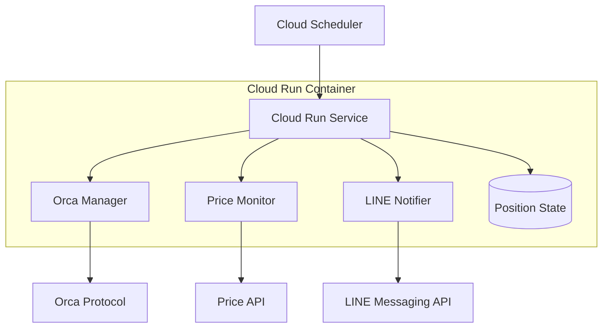

# Design Document: Orca Liquidity Bot

## Overview

Orcaプールでの流動性供給ポジション（SOL-USDC）を自動管理するRustベースのbotシステム。Google Cloud Runでホストされ、Cloud Schedulerによって定期実行される。ポジションのレンジ監視、Yieldの自動回収、ポジションの再設定、およびLINE通知機能を提供する。

## Architecture



システムは以下の主要コンポーネントで構成される：

1. **Scheduler Handler**: Cloud Schedulerからのリクエストを処理
2. **Price Monitor**: 価格データの取得と監視
3. **Position Manager**: Orcaプールでのポジション管理
4. **LINE Notifier**: LINE通知の送信
5. **State Manager**: ポジション状態の永続化

## Components and Interfaces

### 1. Scheduler Handler

```rust
pub struct SchedulerHandler {
    price_monitor: Arc<PriceMonitor>,
    position_manager: Arc<PositionManager>,
    line_notifier: Arc<LineNotifier>,
    state_manager: Arc<StateManager>,
}

impl SchedulerHandler {
    pub async fn handle_hourly_check(&self) -> Result<(), BotError>;
    pub async fn handle_daily_yield_collection(&self) -> Result<(), BotError>;
}
```

### 2. Price Monitor

```rust
pub struct PriceMonitor {
    client: reqwest::Client,
}

pub struct PriceData {
    pub current_price: f64,
    pub timestamp: DateTime<Utc>,
}

impl PriceMonitor {
    pub async fn get_current_price(&self) -> Result<PriceData, PriceError>;
    pub async fn get_historical_price(&self, hours_ago: u32) -> Result<PriceData, PriceError>;
    pub fn is_price_in_range(&self, price: f64, range: &PriceRange) -> bool;
}
```

### 3. Position Manager

```rust
pub struct PositionManager {
    whirlpool_client: WhirlpoolClient,
    wallet: Keypair,
}

pub struct Position {
    pub id: String,
    pub range: PriceRange,
    pub sol_amount: f64,
    pub usdc_amount: f64,
    pub total_value_usdc: f64,
}

pub struct PriceRange {
    pub lower_bound: f64,
    pub upper_bound: f64,
}

impl PositionManager {
    pub async fn get_current_position(&self) -> Result<Position, PositionError>;
    pub async fn collect_yield(&self) -> Result<f64, PositionError>;
    pub async fn close_position(&self, position_id: &str) -> Result<(), PositionError>;
    pub async fn create_position(&self, range: PriceRange, sol_amount: f64, usdc_amount: f64) -> Result<Position, PositionError>;
    pub fn calculate_optimal_range(&self, current_price: f64, volatility: f64) -> PriceRange;
}
```

### 4. LINE Notifier

```rust
pub struct LineNotifier {
    client: LineClient,
    channel_access_token: String,
    user_id: String,
}

pub struct NotificationData {
    pub position_range: Option<PriceRange>,
    pub total_balance: f64,
    pub sol_usdc_ratio: (f64, f64),
    pub collected_yield: f64,
    pub sol_price_usdc: f64,
}

impl LineNotifier {
    pub async fn send_reposition_notification(&self, data: &NotificationData) -> Result<(), NotificationError>;
    pub async fn send_daily_yield_notification(&self, data: &NotificationData) -> Result<(), NotificationError>;
}
```

### 5. State Manager

```rust
pub struct StateManager {
    storage_path: PathBuf,
}

pub struct BotState {
    pub last_check_time: DateTime<Utc>,
    pub current_position: Option<Position>,
    pub last_yield_collection: DateTime<Utc>,
}

impl StateManager {
    pub async fn load_state(&self) -> Result<BotState, StateError>;
    pub async fn save_state(&self, state: &BotState) -> Result<(), StateError>;
}
```

## Data Models

### Core Data Structures

```rust
#[derive(Debug, Clone, Serialize, Deserialize)]
pub struct PriceRange {
    pub lower_bound: f64,
    pub upper_bound: f64,
}

#[derive(Debug, Clone, Serialize, Deserialize)]
pub struct Position {
    pub id: String,
    pub range: PriceRange,
    pub sol_amount: f64,
    pub usdc_amount: f64,
    pub total_value_usdc: f64,
    pub created_at: DateTime<Utc>,
}

#[derive(Debug, Clone, Serialize, Deserialize)]
pub struct PriceData {
    pub current_price: f64,
    pub timestamp: DateTime<Utc>,
}

#[derive(Debug, Clone, Serialize, Deserialize)]
pub struct BotState {
    pub last_check_time: DateTime<Utc>,
    pub current_position: Option<Position>,
    pub last_yield_collection: DateTime<Utc>,
}

#[derive(Debug, Clone)]
pub struct NotificationData {
    pub position_range: Option<PriceRange>,
    pub total_balance: f64,
    pub sol_usdc_ratio: (f64, f64),
    pub collected_yield: f64,
    pub sol_price_usdc: f64,
}
```

### Error Types

```rust
#[derive(Debug, thiserror::Error)]
pub enum BotError {
    #[error("Price monitoring error: {0}")]
    Price(#[from] PriceError),
    #[error("Position management error: {0}")]
    Position(#[from] PositionError),
    #[error("Notification error: {0}")]
    Notification(#[from] NotificationError),
    #[error("State management error: {0}")]
    State(#[from] StateError),
}

#[derive(Debug, thiserror::Error)]
pub enum PriceError {
    #[error("Failed to fetch price data")]
    FetchFailed,
    #[error("Invalid price data")]
    InvalidData,
    #[error("Network error: {0}")]
    Network(#[from] reqwest::Error),
}

#[derive(Debug, thiserror::Error)]
pub enum PositionError {
    #[error("Failed to interact with Orca protocol")]
    OrcaInteractionFailed,
    #[error("Insufficient funds")]
    InsufficientFunds,
    #[error("Transaction failed")]
    TransactionFailed,
}

#[derive(Debug, thiserror::Error)]
pub enum NotificationError {
    #[error("Failed to send LINE notification")]
    SendFailed,
    #[error("Invalid LINE configuration")]
    InvalidConfig,
}

#[derive(Debug, thiserror::Error)]
pub enum StateError {
    #[error("Failed to load state")]
    LoadFailed,
    #[error("Failed to save state")]
    SaveFailed,
}
```

## Correctness Properties

*A property is a characteristic or behavior that should hold true across all valid executions of a system-essentially, a formal statement about what the system should do. Properties serve as the bridge between human-readable specifications and machine-verifiable correctness guarantees.*

### Property Reflection

After reviewing the prework analysis, several properties can be consolidated to eliminate redundancy:

- Properties 1.4, 2.3, 3.1, and 3.2 all relate to notification content and can be combined into comprehensive notification properties
- Properties 4.1 and 4.2 both relate to price data fetching and can be combined
- Properties 5.2 and 5.3 both relate to position operations and can be combined into transaction properties

### Correctness Properties

Property 1: Range monitoring accuracy
*For any* position with a defined price range and any current price data, the range check should correctly identify whether the price is within the range bounds
**Validates: Requirements 1.1**

Property 2: Repositioning trigger conditions
*For any* position and price history, repositioning should only occur when both current price and 1-hour-ago price are outside the position range
**Validates: Requirements 1.2**

Property 3: Optimal range calculation
*For any* market conditions (current price and volatility), the calculated optimal range should have reasonable bounds (lower < upper, positive values, within market constraints)
**Validates: Requirements 1.3, 5.1**

Property 4: Daily yield collection timing
*For any* system state at 00:00 daily, yield collection should be triggered automatically
**Validates: Requirements 2.1**

Property 5: Yield inclusion in repositioning
*For any* yield collection operation, the subsequent repositioning should include the collected yield in the new position
**Validates: Requirements 2.2**

Property 6: Notification content completeness
*For any* repositioning or daily yield collection event, the sent notification should contain all required information (position range, total balance, SOL/USDC ratio, collected yield, SOL price)
**Validates: Requirements 3.1, 3.2**

Property 7: Japanese message formatting
*For any* notification data, the formatted message should be in Japanese and contain all provided information in a readable format
**Validates: Requirements 3.3**

Property 8: Notification retry mechanism
*For any* notification sending failure, the system should retry up to 3 times and log each failure attempt
**Validates: Requirements 3.4**

Property 9: Price data fetching reliability
*For any* price monitoring request, the system should attempt to fetch both current and historical price data from configured sources
**Validates: Requirements 4.1, 4.2**

Property 10: Price data error handling
*For any* price data unavailability, the system should handle the error gracefully, log the issue, and retry the operation
**Validates: Requirements 4.3**

Property 11: Price data validation
*For any* fetched price data, the system should validate data integrity (positive values, reasonable ranges, valid timestamps) before using it
**Validates: Requirements 4.4**

Property 12: Position operation atomicity
*For any* repositioning operation, either both closing the old position and creating the new position succeed, or both operations are rolled back
**Validates: Requirements 5.3**

Property 13: Position operation error handling
*For any* position operation failure, the system should handle the error appropriately and send notification via LINE
**Validates: Requirements 5.4**

Property 14: System error logging
*For any* system error, detailed error information should be logged with appropriate log levels for debugging purposes
**Validates: Requirements 6.2**

Property 15: Configuration validation
*For any* system startup, all required configurations (API keys, wallet keys, endpoints) should be validated before the system becomes operational
**Validates: Requirements 6.3**

## Error Handling

### Error Recovery Strategies

1. **Price Data Failures**: Retry with exponential backoff, fallback to alternative price sources
2. **Orca Protocol Failures**: Log error, notify user, retry after delay
3. **LINE Notification Failures**: Retry up to 3 times, log failure for manual intervention
4. **State Persistence Failures**: Use in-memory fallback, attempt to restore on next run

### Error Notification

Critical errors that affect position management will be reported via LINE notifications to ensure user awareness.

## Testing Strategy

### Multi-Layer Testing Approach

The system will use three complementary testing layers for comprehensive coverage:

**Unit Tests**:
- Specific examples of price range calculations
- Edge cases for notification formatting
- Error condition handling
- Integration points between components

**Property-Based Tests**:
- Universal properties across all inputs using `proptest` crate
- Minimum 100 iterations per property test
- Each test tagged with format: **Feature: orca-liquidity-bot, Property {number}: {property_text}**
- Comprehensive input coverage through randomization

**Solana Devnet Integration Tests**:
- Real blockchain interaction testing using Solana devnet
- Actual Orca pool operations with test tokens
- End-to-end workflow validation in controlled environment
- Network resilience and transaction confirmation testing

### Devnet Testing Configuration

**Test Environment Setup**:
- Use Solana devnet for safe testing without real funds
- Configure test wallet with devnet SOL for transaction fees
- Use Orca devnet pools for liquidity operations
- Mock LINE notifications during devnet tests

**Devnet Test Scenarios**:
- Position creation and management with real Orca pools
- Yield collection and redistribution workflows
- Price monitoring with actual market data
- Error handling with real network conditions
- Transaction confirmation and retry mechanisms

**Test Data Management**:
- Use devnet faucet for obtaining test SOL and USDC
- Maintain separate test wallet for devnet operations
- Clean up test positions after test completion
- Log all devnet transactions for debugging

**Property Test Configuration**:
- Use `proptest` crate for property-based testing in Rust
- Configure each test to run minimum 100 iterations
- Tag each test with reference to design document property
- Focus on universal properties that hold for all inputs

**Testing Balance**:
- Unit tests focus on specific examples, edge cases, and error conditions
- Property tests verify universal correctness properties across randomized inputs
- Devnet integration tests validate real-world blockchain interactions
- All three approaches are complementary and necessary for comprehensive coverage

**Test Execution Strategy**:
- Unit and property tests run in CI/CD pipeline for every commit
- Devnet integration tests run on scheduled basis (daily) or before releases
- Separate test suites allow for different execution contexts and requirements